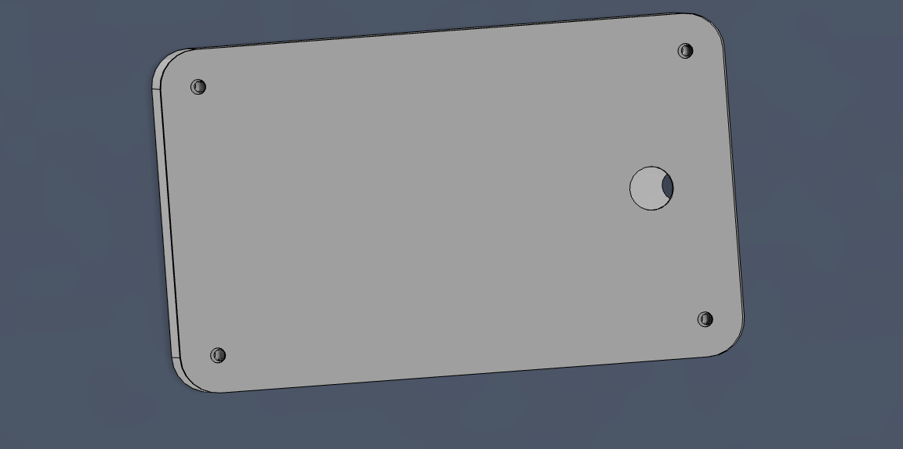
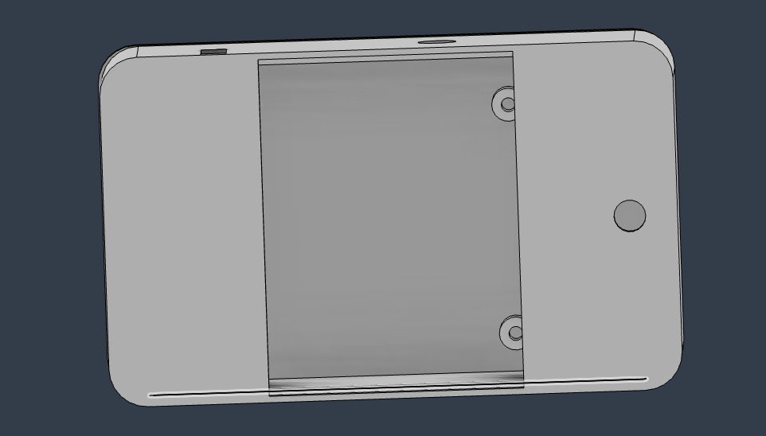
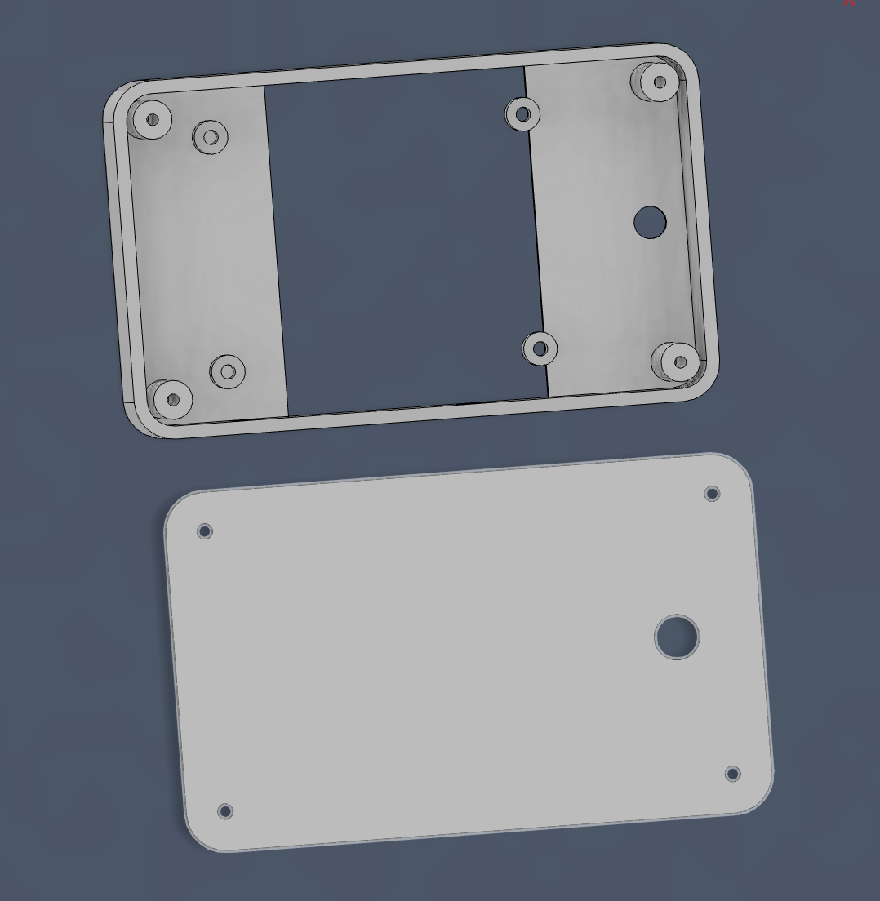

# Esp_Cam
A Esp based digital camera which is inspired from the kodak charmera camera.
I instantly fell into the idea of a mini keychan style camera and wanted to make one on my own which led to make this happen ;)

Im using a seeed studio xiao sense which is the smallest pacakge of both the esp and its camera module and at the same time it comes with a battery charger which made option to go for this projects and paired this with a 2.4 inch tft screen and designed a case for them but not in chamera style but like the ipod which make it look like a phone but can take photo at a really small form factor with 1s2p lithuim polyermer pack which can make it last for a long time.

## Schematics

## Case

