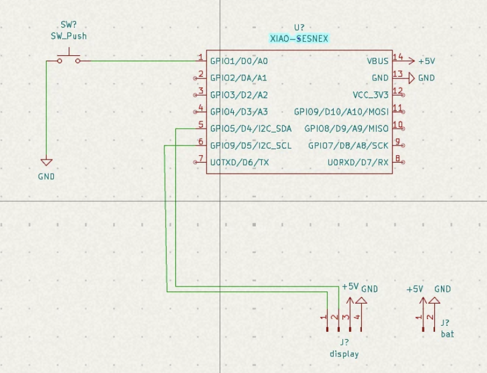

# Esp_Cam
A Esp based digital camera which is inspired from the kodak charmera camera.
I instantly fell into the idea of a mini keychan style camera and wanted to make one on my own which led to make this happen ;)

Im using a seeed studio xiao sense which is the smallest pacakge of both the esp and its camera module and at the same time it comes with a battery charger which made option to go for this projects and paired this with a 2.4 inch tft screen and designed a case for them but not in chamera style but like the ipod which make it look like a phone but can take photo at a really small form factor with 1s3p lithuim polyermer pack which can make it last for a long time.

## Schematics

## Case

### Front

### Back

### Indivudual

## Bill of Materials (BOM)

| S.No | Component | Description | Qty | Category | Distributor |
|------|----------|------------|-----|----------|------------|
| 1 | WLY400838 LiPo Battery | 3.7V 100mAh 1S Micro LiPo Battery | 3 | Battery | Robu |
| 2 | Jumper Wires | 65pcs Flexible Breadboard Jumper Wires | 1 set | Wires | Robu |
| 3 | Micro SD Card | Digitek 4GB C10 Micro SDHC | 1 | Memory | Digitek |
| 4 | Push Button | Tactile Push Button Switch | 2 | Buttons | Robu |
| 5 | TFT Display | 2.4" SPI 240x320 ILI9341 Display | 1 | Display | Robu |
| 6 | XIAO ESP32S3 Sense | Microcontroller with Camera | 1 | MCU | Robocraze |

